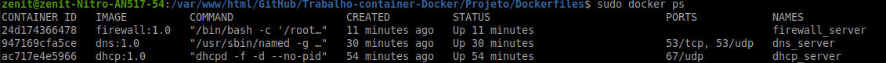
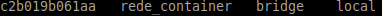
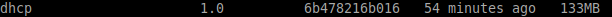
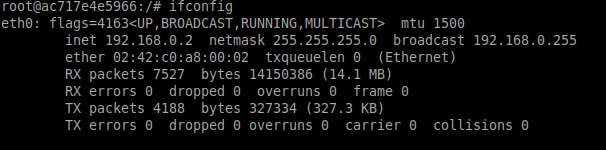
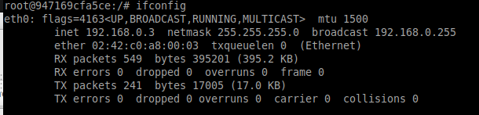
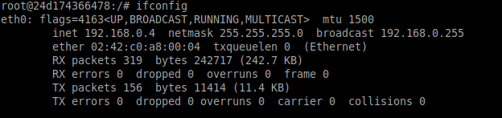
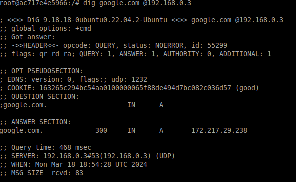
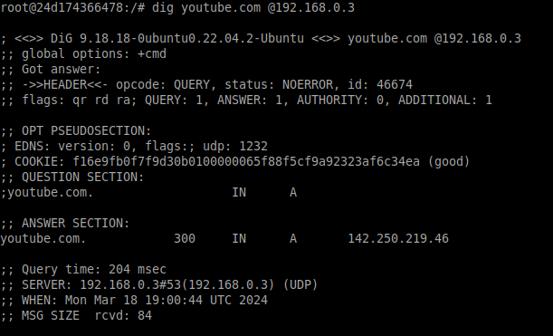
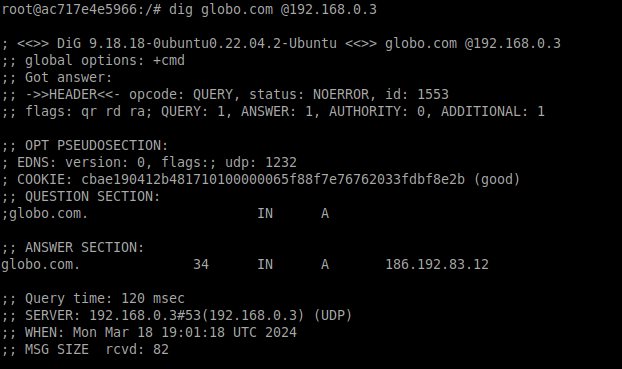
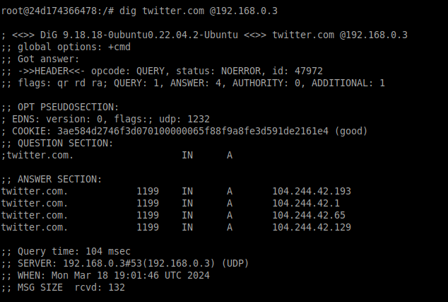

# Trabalho-container-Docker

## Projetando, implantando e gerenciando uma rede empresarial usando tecnologia Linux, com ênfase em serviços como DHCP, DNS e Firewall com Docker.

### Descrição do Trabalho:

- O trabalho tem como objetivo configurar um ambiente de rede em Docker para uma empresa fictícia. Este ambiente deve incluir serviços essenciais de rede, como DHCP, DNS e Firewall, para garantir conectividade e segurança adequadas. Cada serviço de ser configurado em um container Docker separado e garantir que eles se comuniquem adequadamente entre si. Além disso, é necessário criar Dockerfiles para cada imagem necessária, com base na imagem ubuntu:latest, e realizar testes para validar a configuração da rede.

### Tecnologias Utilizadas

- Docker

### Imagens Docker Utilizadas

- [Imagem Ubuntu](https://hub.docker.com/_/ubuntu)

### Funcionamento

Para que o usuário consiga rodar o projeto, ele deverá clonar este repositório em seu computador e ter instalado na sua máquina a seguinte ferramenta:

- Docker

- Utilizando-se da própria maquina host, inicia-se a criação de uma imagem através dos Dockerfiles localizados na pasta do projeto e a inicialização das imagens em um container.

### Topologias, Estruturas Utilizadas e Funcionamento dos Serviços

- O primeiro container docker que será criado é um container que proverá serviços DHCP. O container receberá um arquivo [dhcp.conf](Projeto/Dockerfiles/dhcpd.conf) contendo as devidas configurações para o serviço. Também, o container será liberado a porta 67/udp e será por ela que o servidor DHCP atribuirá o ip para novas maquinas que aparecerem na rede.

- O segundo container irá iniciar um servidor DNS para resolver os nomes de dominio dentro da rede. Ao iniciar, ele estará com o arquivo de configuração [dhcp.conf](Projeto/Dockerfiles/named.conf.options) que possuí as atribuições necessárias para realizar a resolução dos nomes na rede, liberando também a porta 53 tcp/udp.

- O terceiro container executara um servidor firewall que por sua vez através do script [firewall.sh](Projeto/Dockerfiles/firewall.sh) realizará as configurações de firewall da rede, bloqueando o acesso de todas as portas e liberando somente para as de dhcp e dns liberadas nos containers anteriores.

### Testes e resultados

- Os serviços foram testados na seguinte sequência

  - Containers
  - Atribuição de IPs (DHCP)
  - Resolução de nomes de dominíos (DNS)
  - Conectividade entre os dispositivos na rede (Firewall)

- #### Containers

  - Cada container foi iniciado utilizando as imagens criadas através dos dockerfiles dos serviços: [DHCP](Projeto/Dockerfiles/dhcp),[DNS](Projeto/Dockerfiles/dns) e [Firewall](Projeto/Dockerfiles/firewall). Conforme a imagem abaixo indica:

  

- #### DHCP

  - Para testar a atribuição de IPs pelo servidor DHCP, foi criado uma rede docker isolada para os containers e seu serviços através do comando:

  ```shell
  sudo docker network create --subnet=192.168.0.0/24 rede_container
  ```

  

  - Após a criação da rede foi buildada a imagem que contem o servidor dhcp e a atribuição de suas configurações:

  ```shell
  sudo docker build -f dhcp -t dhcp:1.0 .
  ```

  

  - O proximo passo foi iniciar o container com a imagem recém buildada e atribuir a ele o IP fixo da rede criada inicialmente:

  ```shell
  sudo docker run -d --name dhcp_server --restart always --net rede_container --ip 192.168.0.2 dhcp:1.0
  ```  

  

  - Por fim, ao acessar o container do servidor DHCP, DNS e Firewall, é capaz de observar a atribuição automática do IP na mesma faixa da rede docker criada:

  

  

  

- #### DNS

  - Para testar a resolução de nomes de dominío pelo servidor DNS (192.168.0.3), dentro do container do servidor DHCP e Firewall realizei consultas com a ferramenta "dig". Essa ferramenta pode ser instalada com o comando:

  ```shell
  apt-get install dnsutils
  ```

  - As consultas foram feitas usando os dominíos: google.com, youtube.com, globo.com e twitter.com conforme as imagens abaixo.

  
  
  
  

- #### Firewall

  - Para testar o serviço FTP, na sua máquina você deverá executar o seguinte comando no console

  ```shell
  ftp 192.168.56.2 21
  ```

  - Quando pedir usuário digite `kkazin` e a senha: `kkazin`. Se a conexão for estabelecida, você poderá utilizar o comando `put` para adicionar um arquivo e `get` para fazer o download deste arquivo.
    